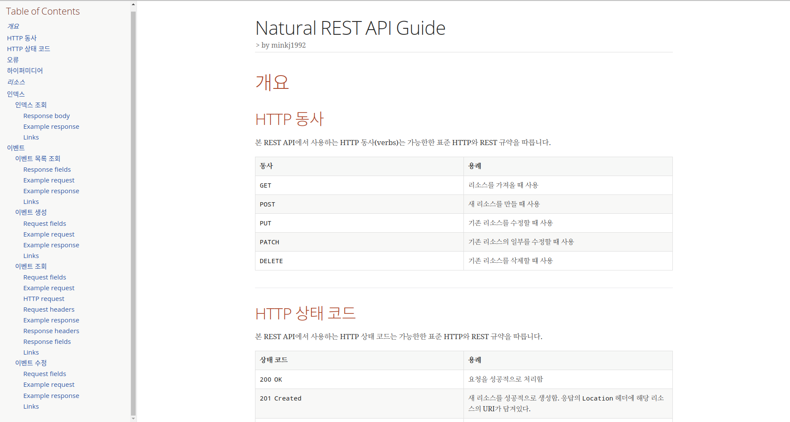
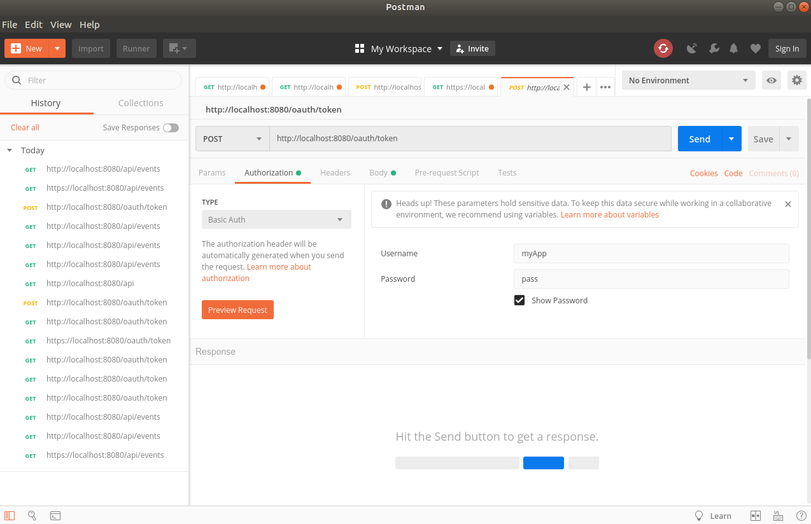
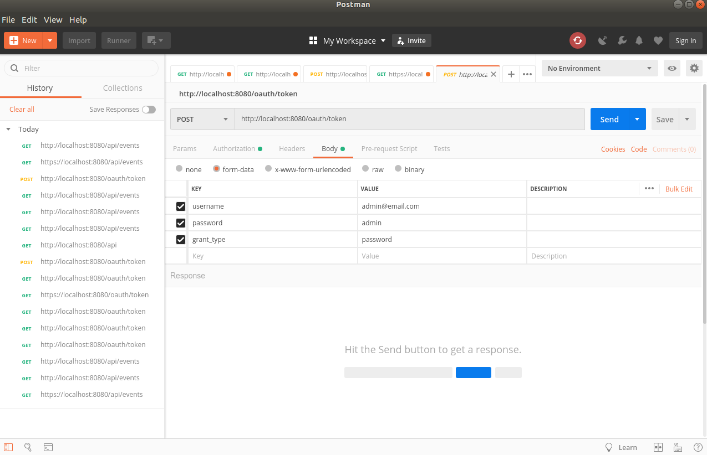

# 1. Spring RESTful Api
> `Spring`을 활용한 RESTful(`Self-descriptive`, `HATEOAS`)한 API 생성


<!-- TOC -->

- [1. Spring RESTful Api](#1-spring-restful-api)
    - [1.1. 기술 스택](#11-기술-스택)
- [2. 개발 목표](#2-개발-목표)
- [3. 개발 과정](#3-개발-과정)
    - [3.1. 개발환경 세팅](#31-개발환경-세팅)
    - [3.2. `Event` Domain 구현](#32-event-domain-구현)
    - [3.3. 이벤트 생성 API](#33-이벤트-생성-api)
        - [3.3.1. EventController Test `createEvent()` 생성](#331-eventcontroller-test-createevent-생성)
        - [3.3.2. `EventController createEvent()` 생성](#332-eventcontroller-createevent-생성)
        - [3.3.3. 입력값 제한하기](#333-입력값-제한하기)
        - [3.3.4. 입력값 이외에 에러발생](#334-입력값-이외에-에러발생)
        - [3.3.5. Bad Request 처리](#335-bad-request-처리)
            - [3.3.5.1. 입력값 Empty](#3351-입력값-empty)
            - [3.3.5.2. 입력값 Wrong value](#3352-입력값-wrong-value)
        - [3.3.6. TEST CODE Description 추가](#336-test-code-description-추가)
        - [3.3.7. Bad Request 응답](#337-bad-request-응답)
        - [3.3.8. 비즈니스 로직 추가](#338-비즈니스-로직-추가)
        - [3.3.9. 비즈니스 로직 테스트 리펙토링](#339-비즈니스-로직-테스트-리펙토링)
    - [3.4. `HATEOAS`와 `Self-Describtive Message` 적용](#34-hateoas와-self-describtive-message-적용)
        - [3.4.1. `HATEOAS` 적용](#341-hateoas-적용)
        - [3.4.2. `REST Docs` 적용](#342-rest-docs-적용)
        - [3.4.3. 스프링 REST Docs 각종 문서 조각 생성하기](#343-스프링-rest-docs-각종-문서-조각-생성하기)
        - [3.4.4. 스프링 REST Docs 문서 빌드](#344-스프링-rest-docs-문서-빌드)
        - [3.4.5. 테스트용 DB와 설정 분리하기](#345-테스트용-db와-설정-분리하기)
    - [3.5. 이벤트 조회 및 수정 REST API 개발](#35-이벤트-조회-및-수정-rest-api-개발)
        - [3.5.1. 이벤트 목록 조회 API 구현](#351-이벤트-목록-조회-api-구현)
        - [3.5.2. 이벤트 단일 조회 API](#352-이벤트-단일-조회-api)
        - [3.5.3. 이벤트 수정 API](#353-이벤트-수정-api)
        - [3.5.4. 테스트 코드 리팩토링](#354-테스트-코드-리팩토링)
    - [3.6. REST API 보안 적용](#36-rest-api-보안-적용)
        - [3.6.1. Account 도메인 추가](#361-account-도메인-추가)
        - [3.6.2. 스프링 시큐리티 적용](#362-스프링-시큐리티-적용)
        - [3.6.3. 예외 테스트](#363-예외-테스트)
        - [3.6.4. 스프링 시큐리티 기본 설정](#364-스프링-시큐리티-기본-설정)
        - [3.6.5. 스프링 시큐리티 폼 인증 설정](#365-스프링-시큐리티-폼-인증-설정)
        - [3.6.6. 스프링 시큐리티 OAuth2 인증 서버 설정](#366-스프링-시큐리티-oauth2-인증-서버-설정)
        - [3.6.7. 리소스 서버 설정](#367-리소스-서버-설정)
        - [3.6.8. 문자열을 외부 설정으로 빼내기](#368-문자열을-외부-설정으로-빼내기)
        - [3.6.9. Postman을 통한 api 점검](#369-postman을-통한-api-점검)
        - [3.6.10. 현재 사용자 조회](#3610-현재-사용자-조회)
        - [3.6.11. 출력값 제한하기](#3611-출력값-제한하기)
        - [3.6.12. TODO: 추가해주어야 할 점](#3612-todo-추가해주어야-할-점)

<!-- /TOC -->


- `http://localhost:8080/docs/index.html`
- ascii-docs를 활용한 document 정보



## 1.1. 기술 스택
- `Spring boot`
- `Spring framework`
- `Spring data JPA`
- `Spring HATEOAS`
- `Spring REST Docs`
- `Spring Security OAuth2` 
- `TDD`

# 2. 개발 목표

# 3. 개발 과정

## 3.1. 개발환경 세팅
- `mvn package`
## 3.2. `Event` Domain 구현
- `Event` 클래스 생성
- Test
    - `@Builder`를 활용해서 테스트 케이스 생성
    ```java
        @Test
        public void builder() {
            Event event = Event.builder().build();
        }
    ```
    - `@EqualsAndHashCode(of="id")`
        - id 값만으로 EqualsAndHashCode를 비교하라 라는 의미
        - 필요하다면 다른 필드를 더 추가할 수도 있지만 다른 Entity와의 묶음을 만드는 것은 좋지 않음
        - Equals 와 HashCode를 구현할 때 모든 필드를 기본적으로 다 사용함
        - 나중에 Entity 간에 연관관계가 있을 때 **상호참조**하는 관계가 되면 `EqualsAndHashCode`를 구현한 코드 안에서 서로간의 메소드를 계속 호출하다가 스택오버플로우가 발생할 수도 있음

- `EqualsAndHashCode()`
  - `eqauls()`
    - 두 객체의 내용이 같은지 확인하는 Method입니다
  - `hashCode()`
    - 두 객체가 같은 객체인지 확인하는 Method입니다.
    - HashMap() 같은 collection에서 같은 내용의 두 객체를 중복이라 판단하기 위해선, hashCode()에 대한 override()가 필요하다.


```java
    public boolean equals(final Object o) {
        if (o == this) {
            return true;
        } else if (!(o instanceof Event)) {
            return false;
        } else {
            Event other = (Event)o;
            if (!other.canEqual(this)) {
                return false;
            } else {
                label139: {
                    Object this$name = this.getName();
                    Object other$name = other.getName();
                    if (this$name == null) {
                        if (other$name == null) {
                            break label139;
                        }
                    } else if (this$name.equals(other$name)) {
                        break label139;
                    }

                    return false;
                }

                Object this$description = this.getDescription();
                Object other$description = other.getDescription();
                if (this$description == null) {
                    if (other$description != null) {
                        return false;
                    }
                } else if (!this$description.equals(other$description)) {
                    return false;
                }
                
                
                (중략 ....)
                
                
                    }
                }
            }
        }
    }
```
- 이처럼 모든 field에 대하여 Equals를 구현해버린다.
- `@EqualsAndHashCode(of="id")`
```java

    public boolean equals(final Object o) {
        if (o == this) {
            return true;
        } else if (!(o instanceof Event)) {
            return false;
        } else {
            Event other = (Event)o;
            if (!other.canEqual(this)) {
                return false;
            } else {
                Object this$id = this.getId();
                Object other$id = other.getId();
                if (this$id == null) {
                    if (other$id != null) {
                        return false;
                    }
                } else if (!this$id.equals(other$id)) {
                    return false;
                }

                return true;
            }
        }
    }

```
## 3.3. 이벤트 생성 API
### 3.3.1. EventController Test `createEvent()` 생성

```java
    @Test
    public void 입력값_JSON_201응답() throws Exception {
        //given
        mockMvc.perform(post("/api/events/")    // "/"로 앞,뒤 막아준다.
                .contentType(MediaType.APPLICATION_JSON)
                .accept(MediaTypes.HAL_JSON))
                .andExpect(status().isCreated());
```
- `HAL_JSON`
    - `HyperText Application Language`
        - HAL은 API의 리소스들 사이에 쉽고 일관적인 하이퍼링크를 제공하는 방식이다. API 설계시 HAL을 도입하면 API간에 쉽게 검색이가능하다. 
        - HAL을 API Response 메시지에 적용하면 그 메시지가 JSON 포맷이건 XML 포맷이건 API를 쉽게 찾을 수 있는 메타 정보들을 포함시킬수 있다는 것이다. 
- `MockHttpServletRequestBuilder accept`(java.lang.String… mediaTypes) : ‘Accept’ 헤더를 설정해줍니다.
- `Accept 헤더`
    - 요청을 보낼 때 서버에 이런 타입(`MIME`)의 데이터를 보내줬으면 좋겠다고 명시할 때 사용
    - Accept: image/png, image/gif
    - Accept: text/*
    - **Accept로 원하는 형식을 보내면, 서버가 그에 맞춰 보내주면서 응답 헤더의 Content를 알맞게 설정한다.**
    - 클라이언트 Request Accept-header가 HAL_JSON이라면 서버 method의 응답 body 값이 HAL_JSON일 때만 반응할 수 있다.

### 3.3.2. `EventController createEvent()` 생성

```java
@Controller
@RequestMapping(value = "/api/events/", produces = MediaTypes.HAL_JSON_VALUE)
@RequiredArgsConstructor
public class EventController {

    private final EventRepository eventRepository;

    @PostMapping
    public ResponseEntity createEvent(@RequestBody Event event) {
        Event newEvent = eventRepository.save(event);
        URI createdUri = linkTo(EventController.class).slash(newEvent.getId()).toUri();
        return ResponseEntity.created(createdUri).body(newEvent);
    }
}
```
- `@RequestMapping(value = "/api/events/", produces = MediaTypes.HAL_JSON_VALUE)`
    - URL을 컨트롤러의 메서드와 매핑할 때 사용하는 스프링 프레임워크의 어노테이션
    - `produces=`
      - String[]설정과 Accept request 헤더가 일치할 경우에만 URL이 호출됨
      - **Response시 해당 type으로 body를 만들어줄 것을 보증한다**
- `import static org.springframework.hateoas.server.mvc.ControllerLinkBuilder.linkTo;`
    - Deprecated: use `WebMvcLinkBuilder` instead.
    - `import static org.springframework.hateoas.server.mvc.WebMvcLinkBuilder.linkTo;`
- `org.springframework.http.ResponseEntity`
    - HTTP response 객체 생성
    - HTTP의 표준 규약을 지켜서 Response 하게 해준다
    - 이를 통해 client는 서버의 응답에 신뢰를 가진다.
    - `Entity.created(URI).build()` 하면 ResponseEntity가 생성된다.
    - HttpEntity를 상속받음
      - HttpHeader
      - HttpBody
    - linkTo로 생성된 uri 정보를 created에 넣어주면 HTTP Header에 Location=http://localhost/api/events/1와 같은 값이 들어가게 된다.
    - body에 event 즉 java 클래스 그대로 주었는데 MockMvc에서는 json형태로 보여진다. 도대체 언제 ResponseBody로 변환 되었을까?
      - ResponseEntity = http header + @ResponseBody(json)
      - @RequestMapping(produces)에 HAL_JSON을 명시해주어 return 값이 HAL_JSON임을 보장해준다.
- `@RequestBody`
  - HttpBody (json, HAL_json)  ->  Java Object
- `@ResponseBody`
  - Java Object -> HttpBody (json, HAL_json)
- `HATEOAS`를 통해서 class의 method를 불러주고 뒤에 `/{id}`를 붙여준 URI를 만든다.
- 이후 ResponseEntity를 통해 URi를 create()시킨 builer를 .build()시켜준다. 
- 테스트를 돌려보면 응답값을 볼 수 있다.
```json

MockHttpServletRequest:
      HTTP Method = POST
      Request URI = /api/events/
       Parameters = {}
          Headers = [Content-Type:"application/json", Accept:"application/hal+json"]
             Body = <no character encoding set>
    Session Attrs = {}

Handler:
             Type = com.minkj1992.springrestapi.events.EventController
           Method = com.minkj1992.springrestapi.events.EventController#createEvent()

Async:
    Async started = false
     Async result = null

Resolved Exception:
             Type = null

ModelAndView:
        View name = null
             View = null
            Model = null

FlashMap:
       Attributes = null

MockHttpServletResponse:
           Status = 201
    Error message = null
          Headers = [Location:"http://localhost/api/events/%257Bid%257D"]
     Content type = null
             Body = 
    Forwarded URL = null
   Redirected URL = http://localhost/api/events/%257Bid%257D
          Cookies = []

```
- 참고로 `%257Bid%257D`값은 .slash("{id}")에서 String 객체의 byte코드를 기반으로 /뒤에 해당 값을 넣어준 것같다.

- `.andExpect(jsonPath("id").exists());`
    - Error:(57, 49) java: incompatible types: org.springframework.test.web.client.RequestMatcher cannot be converted to org.springframework.test.web.servlet.ResultMatcher
    - 찾아보니 `client`, `servlet`이렇게 같은 이름으로 여러개가 존재하였다.
- `MediaTypes`
    - **만약 `@RequestMapping(value="/api/events",produces = MediaTypes.HAL_FORMS_JSON_VALUE)`를 controller에 해주고, test에서 `HAL_JSON_VALUE` 해주면 406에러 뜬다.**
    - `Resolved Exception:
             Type = org.springframework.web.HttpMediaTypeNotAcceptableException` 에러가 뜬다.
    - @TODO: 차이가 뭘까?
    - `HAL_JSON_VALUE`
    - `HAL_JSON`
    - `HAL_FORMS_JSON_VALUE` 
    - `MediaType.APPLICATION_JSON`
        - "public constant media type for application/json"
    - `MediaType.APPLICATION_JSON_VALUE`
        -  "String equivalent of MediaType.APPLICATION_JSON"

### 3.3.3. 입력값 제한하기
> 입력값 중 id, price와 같은 필드들은 입력을 받아 update 되면 안된다.
- 테스트 코드중 일부
```java
        mockMvc.perform(post("/api/events/")    // 앞 뒤로 /막아주어야 한다.
                .contentType(MediaType.APPLICATION_JSON)
                .accept(MediaTypes.HAL_JSON_VALUE)
                .content(objectMapper.writeValueAsString(event)))
```

- `import com.fasterxml.jackson.databind.ObjectMapper;`

- DTO 생성
- `ModelMapper`를 통한 builder 패턴 간소화
    - mvn 의존성 가져오기
- `Matchers.not()`을 통한 setId, setStatus, .... 이 테스트에서 통과되지 않는지 검사
    - `Matchers`가 deprecated되었다.
    - @TODO: Matchers를 대체하여 테스트하는 방법 찾기
- `@AutoConfigureMockMvc`
  - `@SpringBootTest + @AutoConfigureMockMvc`는 통합테스트를 할 때 사용한다.
  - `@WebMvcTest`는 MVC쪽만 슬라이스(slice) 테스트를 할 때 사용한다.

- `HttpHeaders.LOCATION`
  - The Location response header indicates the URL to redirect a page to. It only provides a meaning when served with a 3xx (redirection) or 201 (created) status response.
  - `Location`
    - the target of a redirection (or the URL of a newly created resource)
  - `Content-Location`
    - 해당 개체의 실제 위치를 알려준다.
    - Content-Location is associated with the entity returned.

### 3.3.4. 입력값 이외에 에러발생
> 입력값 중 id, price와 같은 필드들은 입력을 받아 update 되면 에러를 발생시킨다.
```java
public void createEvent_Bad_Request() throws Exception {
        ...
}
```
- `spring.jackson.deserialization.fail-on-unknown-properties=true`
  - Json -> Object이 deserialization이라고 한다.
  - 해당 과정 도중 **받기로 한 값 이외(id, free, offline 값 등)에** 을 받는다면, `Bad Request 400 에러` 발생하도록 한다.
  - Jackson 라이브러리에서 기본적으로 없는 속성이 정의된 경우 이를 무시하는데, 테스트케이스에서 이를 잡아주기 위해서는 해당 값을 true로 두어 예외처리 해주어야 한다.
  - 실제로 해당 값을 두지 않는다면 test에서 잘못된 값을 주더라도 `201` return 하게된다.

### 3.3.5. Bad Request 처리
> 입력값이 이상한 경우에 Bad Request를 보내는 방법

- `org.springframework.validation.Errors`
  - `errors.hasErrors()`
  - javax에서 적용하는 validation을 errors에 담아준다.
- `javax.validation.Valid`
  - `@Valid`
    - 해당 어노테이션이 붙여진 위치에 `Validator.validate() `검사함
  - `validate()`
    - Bean에 대한 유효성을 검사한다.
    - 여기서의 Bean은 Spring의 Bean이 아닌, `자바빈`을 의미한다.
  - 엔티티의 field에 @NotNull, @NotEmpty와 같은 어노테이션을 작성한다.
- 참고로 spring validation 코드는 javax의 validation을 사용한다.

- `javax` vs `java`
  - 둘 모두 `JAVA SE`즉 표준 에디션이다.
    - `JAVA EE`에는 jsp, JDBC등이 포함되어있다.
      - `JAVA EE` = `JAVA SE` + 추가
    - 참고로 `spring framework`는 EE, SE 둘 모두에도 포함되지 않는다.
  - `javax 패키지`
    - extension package
    - 원래는 공식으로 채택되면 x가 빠져야하지만 기존 레거시코드에 x를 모두 리팩토링 해야하기 때문에 그대로 extension에서 가지를 쳐가며 발전함.
  - `java 패키지`
    - JAVA 언어 core package

- `Spring Bean` vs `JavaBean`
  - `Spring Bean`
    - `Spring IoC 컨테이너`에 의해 관리되는 객체
    - 애플리케이션을 구성하는 구성요소 
  - `JavaBean`
    - 데이터를 표현하는 것을 목적으로 하는 자바 클래스.
    - 컴포넌트와 비슷한 의미로도 사용된다.
    - JavaBean 규격서에 따라 작성된 자바 클래스를 가리킨다.
    - JavaBean의 목적은 여러가지 다른 오브젝트들을 하나의 오브젝트(Bean)에 담기 위함이다. JavaBean의 규칙을 소프트웨어 프로토콜이라고 생각하면 쉽다.
    - VO, DTO ...

- `Java Bean` VS `POJO`
  - JAVA Bean은 serialized(JVM안에서만 Compile가능)되어야 하지만, Java Object(POJO)는 Http Connection, DB Connection같이 JVM을 넘어선 데이터 값을 가질 수 있다.
  - An object in Java may be a POJO but not a JavaBean. For instance, it may implement an interface or extend specified classes, but because it refers to objects that are stateful and/or exist outside the scope of the Java Virtual Machine (JVM)—for example, HTTP or database connections —it cannot reasonably be serialized to disk and then restored.

- `ResponseEntity.build()`
  - `ResponseEntity.badRequest().build()`
#### 3.3.5.1. 입력값 Empty
```java
    @Test
    public void createEvent_Bad_Request_Empty_Input() throws Exception {
        //given
        EventDto eventDto = EventDto.builder().build();
        //when then
        mockMvc.perform(post("/api/events")
                .contentType(MediaType.APPLICATION_JSON)
                .content(objectMapper.writeValueAsString(eventDto)))
                .andExpect(status().isBadRequest());
    }
```

- Controller `@Valid`추가
- EventDto `@Min(0)`, `@NotEmpty` .. 추가
- Controller `Errors errors` 파라미터 추가
- COntroller DTO Validation 추가
```java
        if (errors.hasErrors()) {
            return ResponseEntity.badRequest().build();
        }

```
#### 3.3.5.2. 입력값 Wrong value
- `EventValidator`클래스 생성
- Controller 검증 코드 추가
- 테스트 추가
```java
@Component
public class EventValidator {

    public void validate(EventDto eventDto, Errors errors) {
        if (eventDto.getBasePrice() > eventDto.getMaxPrice() && eventDto.getMaxPrice() > 0) {
            errors.rejectValue("basePrice", "WrongValue", "BasePrice is Wrong");
            errors.rejectValue("maxPrice", "WrongValue", "MaxPrice is Wrong");
        }

        LocalDateTime endEventDateTime = eventDto.getEndEventDateTime();
        if (endEventDateTime.isBefore(eventDto.getBeginEventDateTime()) ||
                endEventDateTime.isBefore(eventDto.getCloseEnrollmentDateTime()) ||
                endEventDateTime.isBefore(eventDto.getBeginEnrollmentDateTime())) {
            errors.rejectValue("endEventDateTime","WrongValue","endEventDateTime is Wrong");
        }
    }
}
```

- `@Component`는 생성해준 클래스에 IOC의 주입성을 받고 싶을 때 사용한다. (기존에 생성되어 있는 인스턴스는 `@Bean`사용)
### 3.3.6. TEST CODE Description 추가
> 테스트 코드가 길어지니 테스트 description을 추가한다.
- junit5는 이렇게 하지 않아도 되지만, 4에서는 다르게 한다.
```java
@Target(ElementType.METHOD) // method에 대해 검증
@Retention(RetentionPolicy.SOURCE)    //보유,유지: life cycle how long
public @interface TestDescription {
    String value(); //임의로 field명을 생성해줄 수 있다.
}
```

### 3.3.7. Bad Request 응답
> Bad Request 응답에 body가 있도록 한다.
- controller에 bad request시 `.build()` 대신 `.body()`사용
- `Errors` 인스턴스를 `ResponseEntity Body`에 넣어주기 위해서는 Json 타입으로 변환을 해주어야 한다.
- **java Bean은 `BeanSerializer`에 의해서 json으로 변환이 가능하지만, SpringFramework의 Errors는 bean규약을 따르지 않아 따로 serializer를 생성해주어야 한다.**
- `/common/ErrorSerializer`
```java
@JsonComponent  //Spring의 ObjectMapper에 등록
public class ErrorSerializer extends JsonSerializer<Errors> {

    @Override
    public void serialize(Errors errors, JsonGenerator jsonGenerator, SerializerProvider serializerProvider) throws IOException {
        jsonGenerator.writeStartArray();


        errors.getFieldErrors().forEach(e -> {
            try {
                jsonGenerator.writeStartObject(); // start
                jsonGenerator.writeStringField("field",e.getField());
                jsonGenerator.writeStringField("objectName",e.getObjectName());
                jsonGenerator.writeStringField("code",e.getCode());
                jsonGenerator.writeStringField("defaultMessage",e.getDefaultMessage());
                Object rejectedValue = e.getRejectedValue();
                if (rejectedValue != null) {
                    jsonGenerator.writeStringField("rejected", e.getRejectedValue().toString());
                }
                jsonGenerator.writeEndObject(); // end
            } catch (IOException ex) {
                ex.printStackTrace();
            }
        });

        errors.getGlobalErrors().forEach(e ->{
            try {
                jsonGenerator.writeStartObject();
                jsonGenerator.writeStringField("objectName",e.getObjectName());
                jsonGenerator.writeStringField("code",e.getCode());
                jsonGenerator.writeStringField("defaultMessage",e.getDefaultMessage());
                jsonGenerator.writeEndObject();
            } catch (IOException ex) {
                ex.printStackTrace();
            }

        });
        jsonGenerator.writeEndArray();
    }
}
```
- Error를 json으로 변환시켜 전달해준다.
- **ObjectMapper는 Spring의 Errors 타입을 Serialize할 때 `ErrorSerializer`를 사용한다.**
- `Spring Validation`
  - `Errors`
    - 유효성 검증 결과를 저장할 때 사용
  - `BindingResult`
    - `Errors`의 하위 인터페이스
    - 폼 값을 커맨드 객체에 바인딩한 결과를 저장하고 에러 코드로부터 에러 메시지를 가져옴

- Error 구성요소
  - `errors.getGlobalErrors()`
  - `errors.getFieldErrors()`


- 응답값
```json

String parseJS eval
[
{
"field":"endEventDateTime",
"objectName":"eventDto",
"code":"WrongValue",
"defaultMessage":"endEventDateTime is Wrong",
"rejected":"2000-12-14T11:11"
},
{
"objectName":"eventDto",
"code":"WrongPrices",
"defaultMessage":"Values of Prices are Wrong"
}
]
```

### 3.3.8. 비즈니스 로직 추가

- Event Domain Test 추가
    - `testFree()`
    - `testOffline()`
- Domain `update()` 추가
```java
    public void update() {
        free = basePrice == 0 && maxPrice == 0;
        offline = !(location == null || location.isBlank());    //null 검사 먼저 주의
    }
```
### 3.3.9. 비즈니스 로직 테스트 리펙토링
> 테스트 코드의 중복 해결 방법 -> `@RunWith(JUnitParamsRunner.class)`

```java
    @Test
    public void testFree(int basePrice, int maxPrice, boolean isFree) throws Exception {}
    private Object[] parametersForTestFree() {}
```
위와 같은 parameter 함수가 있다면

```java
    @Parameters
    @Parameters(method = "parametersForTestFree")
    @Test
    public void testFree(int basePrice, int maxPrice, boolean isFree) throws Exception {}
```
- 위의 @Parameters 중 아무거 써도 결과가 같다. 
- parametersFor가 convention이여서 찾아준다.


## 3.4. `HATEOAS`와 `Self-Describtive Message` 적용


### 3.4.1. `HATEOAS` 적용
- `ResourceSupport` from Spring-HATEOAS
  - HATEOAS의 resource를 제공해주는 class(impl)
  - ver 1.0.2 이후 부터는 `import org.springframework.hateoas.EntityModel;`를 사용한다.

```java
public class EventResource extends EntityModel<Event> {
	
	/*
	 * self link는 resource마다 설정해줘야 하므로 여기에 공통으로 추가한다.
	 */
	public EventResource(Event event, Link... links) {
		super(event,  links);
		add(linkTo(EventController.class).slash(event.getId()).withSelfRel());
	}
}
```

- `ResourceSupport`는 `@JsonUnwrapped`를 사용하여 BeanSerializer의 json 전략을 회피해주어야 하지만, `EntityModel`는 기본적으로 `@JsonUnwrapped`이 사용된다.

- 최종적으로 아래 3가지를 생성하였다.
  - `self`(view)
  - `update`(수정 링크)
  - `events`(목록으로가는 링크)

```java
    add(linkTo(EventController.class).slash(event.getId()).withSelfRel());
    eventResource.add(linkTo(EventController.class).withRel("query-events"));
    eventResource.add(selfLinkBuilder.withRel("update-event"));
```
- Rel : Link = Key : Value
- `.withRel()`은 링크의 key를 주는 것
- `linkTo(EventController.class)`: http://localhost/api/events
- `selfLinkBuilder`: http://localhost/api/events/{id}

- `EventControllerTest`
```java
    .andExpect(jsonPath("_links.self").exists())
    .andExpect(jsonPath("_links.query-events").exists())
    .andExpect(jsonPath("_links.update-event").exists());
```
- HAL_JSON에서 HATEOAS
  - `_links`: HATEOAS를 만족하는 link정보가 해당 json path에 존재한다.(이름은 규약)


### 3.4.2. `REST Docs` 적용

1. `@AutoConfigureRestDocs`를 만들어 놓은 `test class`위에 작성한다.
2. `.andDo(document())`를 활용하여 `snippet`들을 생성해준다.
3. `org.springframework.boot.test.autoconfigure.restdocs.RestDocsMockMvcConfigurationCustomizer`를 사용하여, snippet들을 커스터마이징 시켜준다.
   1. test 패키지에 문서화 작업을 시행할 configuration 클래스를 생성해준다.
   2. `RestDocsMockMvcConfigurationCustomizer`를 return 해주는 함수를 만들어준다.
4. `@Import(RestDocsConfiguration.class)`를 테스트에 넣어주어 클래스를 설정을 불러온다.
5. 테스트 코드에 문서화 코드 삽입
```java
.andDo(document("create-event",
        links(
                linkWithRel("self").description("link to self"),
                linkWithRel("query-events").description("link to query events"),
                linkWithRel("update-event").description("link to update an existing event"),
                linkWithRel("profile").description("link to update an existing event")
        ),
        requestHeaders(
                headerWithName(HttpHeaders.ACCEPT).description("accept header"),
                headerWithName(HttpHeaders.CONTENT_TYPE).description("content type header")
        ),
        requestFields(
                fieldWithPath("name").description("Name of new event"),
                fieldWithPath("description").description("description of new event"),
                fieldWithPath("beginEnrollmentDateTime").description("begin enroll time"),
                fieldWithPath("closeEnrollmentDateTime").description("close enroll time"),
                fieldWithPath("beginEventDateTime").description("begin event time"),
                fieldWithPath("endEventDateTime").description("end event time"),
                fieldWithPath("location").description("location of new event"),
                fieldWithPath("basePrice").description("base price of new event"),
                fieldWithPath("maxPrice").description("max price of new event"),
                fieldWithPath("limitOfEnrollment").description("limit of enrollment")
        ),
        responseHeaders(
                headerWithName(HttpHeaders.LOCATION).description("Location header"),
                headerWithName(HttpHeaders.CONTENT_TYPE).description("Content type")
        ),
        /**
         * relaxedResponseFields 를 쓰면 모든 필드를 기술할 필요가 없다.
         * 하지만 모든 필드를 기술하지 않으므로 정확한 문서를 만들지 못한다.
         * responseFields를 쓰면 모든 필드를 기술해야 한다.
         */
        relaxedResponseFields(
                fieldWithPath("id").description("Identifier of new event"),
                fieldWithPath("name").description("Name of new event"),
                fieldWithPath("description").description("description of new event"),
                fieldWithPath("beginEnrollmentDateTime").description("begin enroll time"),
                fieldWithPath("closeEnrollmentDateTime").description("close enroll time"),
                fieldWithPath("beginEventDateTime").description("begin event time"),
                fieldWithPath("endEventDateTime").description("end event time"),
                fieldWithPath("location").description("location of new event"),
                fieldWithPath("basePrice").description("base price of new event"),
                fieldWithPath("maxPrice").description("max price of new event"),
                fieldWithPath("limitOfEnrollment").description("limit of enrollment"),
                fieldWithPath("free").description("it tells if this event is free or not"),
                fieldWithPath("offline").description("it tells if this event is offline or not"),
                fieldWithPath("eventStatus").description("event status"),
                fieldWithPath("_links.self.href").description("link to self"),
                fieldWithPath("_links.query-events.href").description("link to query event list"),
                fieldWithPath("_links.update-event.href").description("link to update existing event"),
                fieldWithPath("_links.profile.href").description("link to profile")
        )
));
```
- 구조
  1. Link
  2. Response Header
  3. Response Field(Body)
  4. Request Header
  5. Request Field(Body)

### 3.4.3. 스프링 REST Docs 각종 문서 조각 생성하기

1. 요청 헤더 문서화
2. 요청 필드 문서화
3. 응답 헤더 문서화
4. 응답 필드 문서화
5. 링크 문서화
   1. self
   2. query-events
   3. update-event
   

### 3.4.4. 스프링 REST Docs 문서 빌드

1. main/asciidoc/index.html 생성
2. maven plugin 추가
3. mvn package
4. profile 
   1. test에 profile 추가
   2. controller에 link 추가
      - `eventResource.add(new Link("/docs/index.html#resources-events-create").withRel("profile"));` 

### 3.4.5. 테스트용 DB와 설정 분리하기

- `docker`
  1. 기본 세팅
     - 도커 설치
       - [ubuntu docker 설치](https://hiseon.me/linux/ubuntu/install-docker/)
     - 사용자 group 추가하기
       - `sudo usermod -aG docker $USER`
       - `echo $USER` 하면 현재 로그인된 아이디가 echo 된다.
     - `sudo chmod 666 /var/run/docker.sock`
       - 권한 부여
  2. 도커로 `PostgreSQL` 컨테이너 실행
     - `docker run --name rest -p 5432:5432 -e POSTGRES_PASSWORD=pass -d postgres`
```console
minkj1992@minkj1992-900X5L:~$ docker ps
CONTAINER ID        IMAGE               COMMAND                  CREATED             STATUS              PORTS                    NAMES
06bda7e4d874        postgres            "docker-entrypoint.s…"   3 minutes ago       Up 3 minutes        0.0.0.0:5432->5432/tcp   rest
```
  3. 컨테이너 실행
```console
minkj1992@minkj1992-900X5L:~$ docker exec -i -t rest bash
root@06bda7e4d874:/# 
```
  4. Connect to a database
     - 권한 부여
     - 기본유저와 데이터베이스 이름
```docker
root@06bda7e4d874:/# su - postgres
postgres@06bda7e4d874:~$ 
postgres@06bda7e4d874:~$ psql -d postgres -U postgres
psql (12.2 (Debian 12.2-2.pgdg100+1))
Type "help" for help.

postgres=# 
postgres=# \l
                                 List of databases
   Name    |  Owner   | Encoding |  Collate   |   Ctype    |   Access privileges
   
-----------+----------+----------+------------+------------+--------------------
---
 postgres  | postgres | UTF8     | en_US.utf8 | en_US.utf8 | 
 template0 | postgres | UTF8     | en_US.utf8 | en_US.utf8 | =c/postgres        
  +
           |          |          |            |            | postgres=CTc/postgr
es
 template1 | postgres | UTF8     | en_US.utf8 | en_US.utf8 | =c/postgres        
  +
           |          |          |            |            | postgres=CTc/postgr
es
(3 rows)

postgres=# \dt
Did not find any relations.

```
- spring run
```console

Consider the following:
	If you want an embedded database (H2, HSQL or Derby), please put it on the classpath.
	If you have database settings to be loaded from a particular profile you may need to activate it (no profiles are currently active).

```

Test용 config와 운영 상태의 db가 (`H2`,`postgresQL`) 혼용되어 에러 발생
- `./resources/application.properties`
```properties
#postgres 설정
spring.datasource.username=postgres
spring.datasource.password=pass
spring.datasource.url=jdbc:postgresql://localhost:5432/postgres
spring.datasource.driver-class-name=org.postgresql.Driver

# hibernate 설정
spring.jpa.hibernate.ddl-auto=create-drop
spring.jpa.properties.hibernate.jdbc.lob.non_contextual_creation=true
spring.jpa.properties.hibernate.format_sql=true
logging.level.org.hibernate.SQL=DEBUG
logging.level.org.hibernate.type.descriptor.sql.BasicBinder=TRACE
```
하지만 테스트에 `@SpringBootTest`를 해주어서 .properties를 혼용(h2 대신에, postgres 사용)하기 때문에, test와 application용을 분리 시켜준다.
- 테스트 분리
  - intellij 테스트 리소스 설정
  - `./test/resources/application.properties`생성

- `./test/resources/application.properties` -> `./test/resources/application-test.properties` 이름 변경을 해주어 `./resources/application.properties`에서 불필요한 설정만 오버라이딩 해주어 바꿔준다.
```properties
spring.datasource.username=sa
spring.datasource.password=
spring.datasource.url=jdbc:h2:mem:testdb
spring.datasource.driver-class-name=org.h2.Driver

spring.datasource.hikari.jdbc-url=jdbc:h2:mem:testdb

spring.jpa.properties.hibernate.dialect=org.hibernate.dialect.H2Dialect
```
- 이후 intellij test resource scope에 해당 `.properties`를 추가해준다.
- 설정이 필요한 test 파일에 `@ActiveProfiles("test")` 넣어주기


## 3.5. 이벤트 조회 및 수정 REST API 개발

### 3.5.1. 이벤트 목록 조회 API 구현

```java
@RestController
public class IndexController {

    @GetMapping("/api")
    public RepresentationModel<?> index() {
        RepresentationModel<?> index = new RepresentationModel<>();
        index.add(linkTo(EventController.class).withRel("events"));
        return index;
    }
}
```
- `@RestController`
  - @Controller + @ResponseBody
  - @Controller는 ViewResolver를 통해서 View형태로 return
  - 이에반해 @RestController는 @ResponseBody를 통해, HTTP ResponseBody에 직접 작성하여 return
  - **사용자의 요청이 오면 MessageConverter를 통해서 application/json, text/plain 등 알맞는 형태로 리턴되게 된다.**
- `RepresentationModel`
  - `org.springframework.hateoas`
  - Base class for `DTOs` to collect links.
- 앞선 `EventResource`클래스에 사용된 `import org.springframework.hateoas.EntityModel`과의 차이점
  - public class EntityModel<T> extends RepresentationModel<EntityModel<T>>
  - 그저 RepresentationModel을 상속받은 타입이다.
  - domain object에 link를 전달하기 위해 사용된다.
  - A simple EntityModel wrapping a domain object and adding links to it.
  - **RepresentationModel – is a container for a collection of Links and provides APIs to add those links to the model. EntityModel – represents RepresentationModel containing only single entity and related links.**


- Event 목록 Page 정보와 함께 받기
    - content[0].id 확인
    - pageable 경로 확인
- Sort과 Paging 확인
    - 30개를 만들고, 10개 사이즈로 두번째 페이지 조회하면 이전, 다음 페이지로 가는 링크가 있어야 한다.
    - 이벤트 이름순으로 정렬하기
    - page 관련 링크


- TODO: java.lang.AssertionError: No value at JSON path "_embedded.eventList[0]._links.self"

```java
    private void generateEvent(int i) {
        Event event = Event.builder()
                .name("event" + i)
                .description(i + "th test event")
                .build();
        this.eventRepository.save(event);
    }
```
- `.save`를 해주지 않아서 update가 되지 않았다.


- `./EventController`
```java
import org.springframework.data.domain.Page;
import org.springframework.data.domain.Pageable;
import org.springframework.data.web.PagedResourcesAssembler;
import org.springframework.hateoas.PagedModel;
import org.springframework.web.bind.annotation.GetMapping;

    @GetMapping
    public ResponseEntity<?> queryEvents(Pageable pageable, PagedResourcesAssembler<Event> assembler) {
        Page<Event> page = this.eventRepository.findAll(pageable);
        //EventResource
        PagedModel<EntityModel<Event>> pageResource = assembler.toModel(page, e -> new EventResource(e));
        pageResource.add(new Link("/docs/index.html#resources-events-list").withRel("profile"));
        return ResponseEntity.ok(pageResource);
    }
```

- queryEvents의 `Pageable`에 parameter값은 누가 전달하는가?
```java
    .param("page", "1")
    .param("size", "10")
    .param("sort", "name,DESC"))
```
- mockMVC에서 .param에 해당 key값은 page용 키워드이다. 그러므로 해당 값을 pageable에 전달해준다.
- `PagedResourcesAssembler<Event> assembler`값은 누가 호출해주는가?
    - HATEOAS의 request filter에 여러가지가 있는 것같다.
    - **두번째 인자로 전달되는 `MethodParameterAwarePagedResourcesAssembler`타입의 `PagedResourcesAssembler<Event> assembler`값은 pageable이 존재한다면 자동으로 2번째 인자로 assembler를 받을 수 있도록 허용해주는 듯하다.**

- `eventRepository.finaAll()`
  - `eventRepository`는 `JpaRepository`를 extend한다. 이는 `PagingAndSortingRepository`를 상속받고 있기 때문에 `findAll()`을 사용가능하다.

### 3.5.2. 이벤트 단일 조회 API
- 이벤트 1개 생성 후 생성 검사 test
- 이벤트가 없을 경우 404 error 테스트 추가
- 이벤트가 없다면 404 존재한다면 200으로 return 해주는 controller method() 생성
```java
import java.util.Optional;

    @GetMapping("/{id}")
    public ResponseEntity getEvent(@PathVariable Integer id) {
        Optional<Event> optionalEvent = this.eventRepository.findById(id);
        if (optionalEvent.isEmpty()) {
            return ResponseEntity.notFound().build();
        }
        Event event = optionalEvent.get();
        EventResource eventResource = new EventResource(event);
        eventResource.add(new Link("/docs/index.html#resources-events-get").withRel("profile"));
        return ResponseEntity.ok(eventResource);
    }

```
- `Optional<T>`
  - T 타입의 객체를 받고, 해당 객체가 Null일 수도 있음을 명시한다.
  - Null Check에 대한 Exception을 throw해준다.
  - JAVA8 이후부터 Null Check를 편하게 해주기 위해 사용하는 wrapper class
- JpaRepository의 부모인 CRUDRepository에는 `Optional<T> findById(ID var1)`이 정의되어 있다.

### 3.5.3. 이벤트 수정 API

### 3.5.4. 테스트 코드 리팩토링
- `BaseControllerTest` 생성

## 3.6. REST API 보안 적용
 
### 3.6.1. Account 도메인 추가
- `./accounts/Account`
```java
@Entity
@Getter @Setter @EqualsAndHashCode(of = "id")
@Builder @NoArgsConstructor @AllArgsConstructor
public class Account {
    @Id @GeneratedValue
    private Integer id;

    private String email;

    private String password;

    // 가져올 데이터가 적기도 하고, 거의 모두 필요하니 EAGER 세팅한다.
    @ElementCollection(fetch = FetchType.EAGER)
    @Enumerated(EnumType.STRING)
    private Set<AccountRole> roles;
```
- @ElementCollection(fetch = FetchType.EAGER)

### 3.6.2. 스프링 시큐리티 적용


### 3.6.3. 예외 테스트
### 3.6.4. 스프링 시큐리티 기본 설정
- `./configs/SecurityConfig`
```java
import org.springframework.context.annotation.Configuration;
import org.springframework.security.config.annotation.web.configuration.EnableWebSecurity;
import org.springframework.security.config.annotation.web.configuration.WebSecurityConfigurerAdapter;

@Configuration
@EnableWebSecurity
public class SecurityConfig  extends WebSecurityConfigurerAdapter {
}

```

- 스프링 부트가 제공하는 security 설정은 더이상 작동하지 않는다.
- AppConfig를 생성해주어 modelMapper를 옮겨주고, PasswordEncoder를 설정해준다.

- `PasswordEncoderFactories`
```java
public class PasswordEncoderFactories {
    public static PasswordEncoder createDelegatingPasswordEncoder() {
        String encodingId = "bcrypt";
        Map<String, PasswordEncoder> encoders = new HashMap();
        encoders.put(encodingId, new BCryptPasswordEncoder());
        encoders.put("ldap", new LdapShaPasswordEncoder());
        encoders.put("MD4", new Md4PasswordEncoder());
        encoders.put("MD5", new MessageDigestPasswordEncoder("MD5"));
        encoders.put("noop", NoOpPasswordEncoder.getInstance());
        encoders.put("pbkdf2", new Pbkdf2PasswordEncoder());
        encoders.put("scrypt", new SCryptPasswordEncoder());
        encoders.put("SHA-1", new MessageDigestPasswordEncoder("SHA-1"));
        encoders.put("SHA-256", new MessageDigestPasswordEncoder("SHA-256"));
        encoders.put("sha256", new StandardPasswordEncoder());
        encoders.put("argon2", new Argon2PasswordEncoder());
        return new DelegatingPasswordEncoder(encodingId, encoders);
    }
```
- Encoding된 password 문자열 앞에 Prefix를 붙여서, 인코더 타입에따라서 적절한 인코더를 선택해준다. (어떠한 방식으로 인코딩 됬는지 판단)

- `./configs/SecurityConfig`
```java
    /**
     * filter 적용 (security filter를 적용할지 말지 선택)
     * 이를 해주지 않으면 login 권한이 필요하게 된다. (기본적인 api index 페이지를 가더라도
     */
    @Override
    public void configure(WebSecurity web) throws Exception {
        web.ignoring().mvcMatchers("/docs/index.html");
        // spring boot가 제공해주는 static resource들에 대한 기본위치를 spring security에 적용되지 않도록 설정
        web.ignoring().requestMatchers(PathRequest.toStaticResources().atCommonLocations());
    }
```

### 3.6.5. 스프링 시큐리티 폼 인증 설정
- 기본 admin 사용자 등록
- `httprequest`시 인증 검사 실시
- passwordEncoder를 추가해주어 string  ->  passwordEncoding이후 검사 실시


### 3.6.6. 스프링 시큐리티 OAuth2 인증 서버 설정

- `error_description="query did not return a unique result: 2; nested exception is javax.persistence.NonUniqueResultException:`
- 테스트가 깨지는 이유 ?
    - 매번 BearerToken() 을 가져올때 동일한 email의 유저를 생성하기때문에 해당 유저 조회시 단건의 조회가 일어나지 않음.
    - Spring Test의 특성
        - @SpringBootTest를 사용하여 테스트를 진행하기 때문에 TEST용 ApplicationContext가 생성된다.
        - InMemory DB 를 사용하기 때문에 ApplicationContext 가 죽지 않는 이상 InMemoryDB의 데이터가 공유된다.
        - InMemory DB 간의 데이터가 공유되기 때문에 이런 문제가 발생하는것

- 테스트 코드에 기존 잔류 데이터 삭제
```java
    @Before
    //https://pupupee9.tistory.com/89
    public void setUp () {
        this.accountRepository.deleteAll();
    }
```

- 올바른 결과값 json
```json
{
"access_token":"9e704bc0-80ec-4037-a8b3-f2509d8cacd3",
"token_type":"bearer",
"refresh_token":"a74358c0-9c9f-4d2b-952e-39960d2e8c71",
"expires_in":599,
"scope":"read write"
}
```

### 3.6.7. 리소스 서버 설정
### 3.6.8. 문자열을 외부 설정으로 빼내기
- [intellij @ConfigurationProperties 경고 해결하기](https://stackoverflow.com/questions/48954087/intellij-idea-complains-cannot-resolve-spring-boot-properties-but-they-work-fine)
  

### 3.6.9. Postman을 통한 api 점검

- 인증 토큰 발급 받기



```json
{
    "access_token": "8b0d2fd7-be98-40c3-8572-8371ab574e07",
    "token_type": "bearer",
    "refresh_token": "c8f17ed8-b588-4e13-b24d-af1b252aa71f",
    "expires_in": 599,
    "scope": "read write"
}
```


- 이벤트 목록 조회 API
  - 로그인 하였을 시, token이 존재한다면 `profile`부분에 로그인 하지 않은 사용자와 다르게 추가 정보가 들어가도록 하길 원한다.
  - 현재 상황 `http://localhost:8080/api/events`하였을 때(with token)
```json
{
    "_links": {
        "self": {
            "href": "http://localhost:8080/api/events?page=0&size=20"
        },
        "profile": {
            "href": "/docs/index.html#resources-events-list"
        }
    },
    "page": {
        "size": 20,
        "totalElements": 0,
        "totalPages": 0,
        "number": 0
    }
}
```


### 3.6.10. 현재 사용자 조회

- `@AuthenticationPrincipal`

- 이벤트 조회 API
  - 로그인 했을 때
    - 이벤트 Manager인 경우, 이벤트 수정 링크 제공
```java
    @GetMapping
    public ResponseEntity<?> queryEvents(Pageable pageable,
                                         PagedResourcesAssembler<Event> assembler,
                                         @AuthenticationPrincipal User user) {
        ... 중략 ...
        if (user != null) {
            pageResources.add(linkTo(EventController.class).withRel("create-event"));
        }
        return ResponseEntity.ok(pageResources);
    }
```

- 이벤트 목록 조회 API
  - 로그인 하였을 경우
    - 이벤트 생성 링크 제공

1. `AccountAdapter`클래스를 생성하여 User 정보와 Account 정보를 통합시켜주도록 한다.
2. `@CurrentUser` 어노테이션 생성
   - ```java
        @Target(ElementType.PARAMETER)
        @Retention(RetentionPolicy.RUNTIME)
        @AuthenticationPrincipal(expression = "#this == 'anonymousUser' ? null : account")
        public @interface CurrentUser { }
        ```
    - `@CurrentUser Account currentUser`를 사용하여 현재 Account 값 가져옴
3. create, update, list 요청 모두 현재 사용자 권한에 따라 다른 link가 보여지도록 `EventController` 수정 작업


### 3.6.11. 출력값 제한하기

- `createEvent`시 manager attribute에 email, password 같은 값들을 보여주지 않도록 한다.
- Event Entity에 Manager 항목에 `JsonSerializer`를 추가해주고 이를 담당할 class 를 생성하여, 어떤 데이터를 허용할지 제한한다.


### 3.6.12. TODO: 추가해주어야 할 점
- in-memory h2를 통합 테스트안에서는 테스트 케이스 끼리, 부딪히는 문제로 repository().deleteAll()을 시켜주었지만, JPA table 상에서는 매 테스트마다 drop     되지 않아서 문제가 생겼다.

- 단일 테스트로는 문제가 없지만, 통합테스트에서는 사용자를 생성해주는 테스트케이스(새로운 토큰을 얻어오는 코드)가 깨지게 된다.
